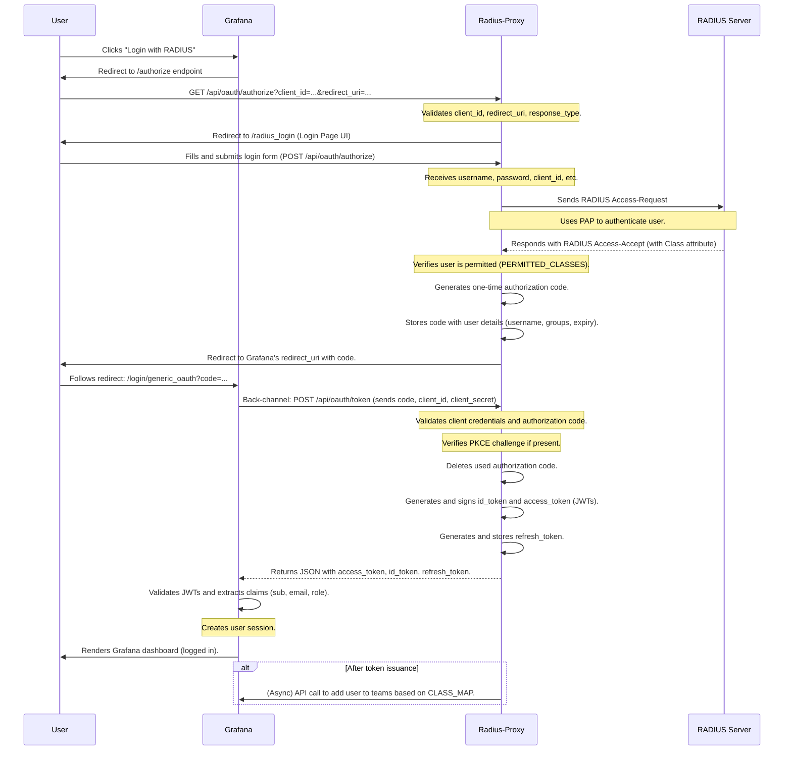

# Authentication Flow

This document provides a detailed, step-by-step breakdown of the complete authentication flow, from the moment a user initiates a login in Grafana to the final token validation and session creation.

## Actors

-   **User**: The person trying to log into Grafana.
-   **Grafana**: The client application that is configured to use `radius-proxy` for authentication.
-   **Radius-Proxy**: This application, acting as the OAuth 2.0 and OIDC provider.
-   **RADIUS Server**: The external authentication authority.

## Sequence Diagram

## Detailed Steps

### Part 1: Authorization Request

1.  **Initiation (Grafana -> Proxy)**
    -   The user clicks the login button in Grafana.
    -   Grafana constructs an OAuth 2.0 authorization URL and redirects the user's browser to it.
    -   This is a `GET` request to the proxy's `/api/oauth/authorize` endpoint.
    -   **Code Reference**: `app/api/oauth/authorize/route.ts` (`GET` handler)
    -   **Parameters included**: `client_id`, `redirect_uri`, `response_type=code`, `state`, and potentially `code_challenge` and `code_challenge_method` for PKCE.

2.  **Request Validation and UI Redirect (Proxy)**
    -   The proxy's `GET` handler for `/api/oauth/authorize` receives the request.
    -   It performs initial validation:
        -   Ensures `client_id`, `redirect_uri`, and `response_type` are present.
        -   Validates that the `client_id` matches the one in its configuration (`OAUTH_CLIENT_ID`).
    -   If valid, it does **not** immediately authenticate. Instead, it redirects the user to its own user-facing login page (`/radius_login`), preserving all the original query parameters (`client_id`, `state`, etc.).

### Part 2: User Authentication

3.  **Credential Submission (User -> Proxy)**
    -   The user sees the login form rendered by `app/page.tsx` and `components/login-form.tsx`.
    -   The user enters their RADIUS username and password and submits the form.
    -   This action sends a `POST` request back to the `/api/oauth/authorize` endpoint.
    -   **Code Reference**: `app/api/oauth/authorize/route.ts` (`POST` handler)
    -   The form body contains the `user`, `password`, and the original OAuth parameters (`client_id`, `redirect_uri`, `state`).

4.  **RADIUS Authentication (Proxy -> RADIUS Server)**
    -   The `POST` handler extracts the credentials.
    -   It retrieves the currently active RADIUS server from the `RadiusHostManager` (`lib/radius_hosts.ts`).
    -   It calls `radiusAuthenticate` from `lib/radius.ts`, which constructs a RADIUS `Access-Request` packet.
    -   The user's password is encrypted using the RADIUS PAP mechanism (MD5 hash of the shared secret and the request authenticator).
    -   The packet is sent over UDP to the RADIUS server.

5.  **RADIUS Response Handling (Proxy)**
    -   The proxy waits for a response from the RADIUS server (with a configurable timeout).
    -   If the credentials are valid, the server returns an `Access-Accept` packet. If not, it returns `Access-Reject`.
    -   The proxy parses the response. If successful, it extracts the `Class` attribute (or the attribute configured via `RADIUS_ASSIGNMENT`).

### Part 3: Authorization Code Issuance

6.  **Permissions Check and Code Generation (Proxy)**
    -   The proxy checks if the user's `Class` attribute is in the `PERMITTED_CLASSES` list (if configured). If not, the flow is terminated with an `access_denied` error.
    -   If permitted, it generates a cryptographically secure, random string to be used as the **authorization code**.
    -   It stores this code in the in-memory storage (`lib/storage.ts`) along with the user's identity (`username`, `groups`), the requested `scope`, and an expiration timestamp (`OAUTH_CODE_TTL`). If PKCE was used, the `code_challenge` is also stored.

7.  **Redirect to Grafana (Proxy -> User -> Grafana)**
    -   The proxy constructs the final redirect URL using the `redirect_uri` provided by Grafana.
    -   Before redirecting, it performs a strict validation on the `redirect_uri` against the `REDIRECT_URIS` allowlist to prevent open redirect attacks.
    -   It appends the newly generated `code` and the original `state` parameter to the URL.
    -   It sends an HTTP `302 Found` redirect response to the user's browser.
    -   The browser follows this redirect, sending the authorization code to Grafana's callback endpoint.

### Part 4: Token Exchange

8.  **Code for Token Exchange (Grafana -> Proxy)**
    -   Grafana receives the authorization code at its callback endpoint.
    -   It then makes a direct, back-channel `POST` request to the proxy's `/api/oauth/token` endpoint.
    -   **Code Reference**: `app/api/oauth/token/route.ts` (`POST` handler)
    -   This request includes the `grant_type=authorization_code`, the `code`, its `client_id`, and its `client_secret`. If using PKCE, it also includes the `code_verifier`.

9.  **Code Validation and Token Generation (Proxy)**
    -   The `/token` endpoint first authenticates the client by checking its `client_id` and `client_secret`.
    -   It looks up the provided `code` in the in-memory storage.
    -   It performs several checks:
        -   Does the code exist?
        -   Has the code expired?
        -   **PKCE Verification**: If a `code_challenge` was stored with the code, it verifies the `code_verifier` from the request against the challenge.
    -   If all checks pass, it **deletes the authorization code** from storage to ensure it can only be used once.

10. **JWT Issuance (Proxy -> Grafana)**
    -   The proxy generates a set of JSON Web Tokens (JWTs) using the `lib/jwt.ts` module:
        -   **`id_token`**: An OIDC token containing claims about the user's identity, such as `sub` (username), `name`, `email`, `groups`, and `role` (if applicable, from `ADMIN_CLASSES`).
        -   **`access_token`**: An OAuth 2.0 token that can be used to access the `/userinfo` endpoint.
        -   **`refresh_token`**: A long-lived token that can be used to get new access tokens.
    -   It sends these tokens back to Grafana in a JSON response.

### Part 5: Session Creation and Team Sync

11. **Login Completion (Grafana)**
    -   Grafana receives the tokens.
    -   It validates the signature and claims of the `id_token` (checking the `iss` and `aud` claims).
    -   It uses the claims within the token to provision a user session, mapping the `role` claim to a Grafana organization role.
    -   The user is now logged into Grafana.

12. **Team Synchronization (Proxy -> Grafana, Optional)**
    -   Asynchronously, after issuing the tokens, the `radius-proxy` can perform an extra step if `GRAFANA_SA_TOKEN` and `CLASS_MAP` are configured.
    -   It uses the user's group information and the `CLASS_MAP` to determine which Grafana teams the user should belong to.
    -   Using the `GRAFANA_SA_TOKEN`, it calls the Grafana API to add the user to the appropriate teams.
    -   This process is best-effort and does not block or fail the authentication flow.
